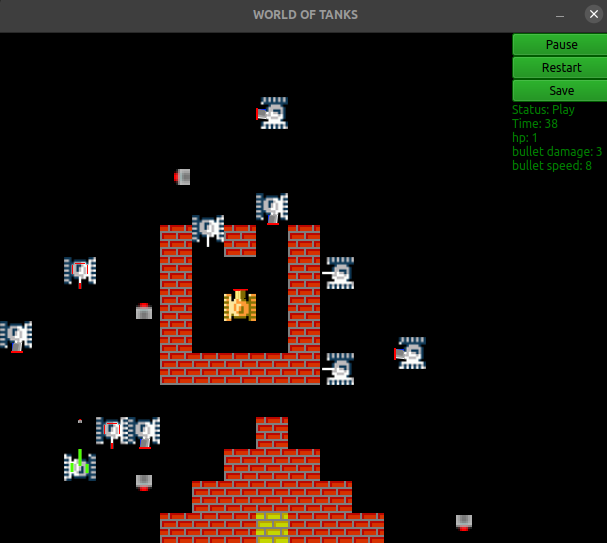

# Battle city
It's hard to admit it, but this is a completely free and open-source breakthrough in the game industry. You can't find anything even close to this masterpiece. 

P.S. The authors of this game are proud of their brainchild

## Menu:

## Game mode:

This game features unique mechanics, realistic shooting, real tanks that have been reproduced from real blueprints. If you always wanted to ride a real tank, then you can practice in this game, the control is as realistic as possible, I assure you like it:

###`Control the arrows and shoot on the space bar`

There are some bugs, but we think it adds realism, because in real combat you can't predict what will happen in a second :)

# Usage:
1) download python version 3.9 or higher;
2) `python3.9 -m pip install -r requirements.txt`;
3) raise PostgresDB and configure it based on the env.json in the root of the project, you can change something in it, but at your own risk, some simple example with docker:
   1) `docker pull postgres`
   2) `docker run -p 5432:5432 -e POSTGRES_USER=user_name -e POSTGRES_PASSWORD=password -e POSTGRES_DB=db_name -d postgres`
4) `python3.9 main.py`
5) Enjoy
